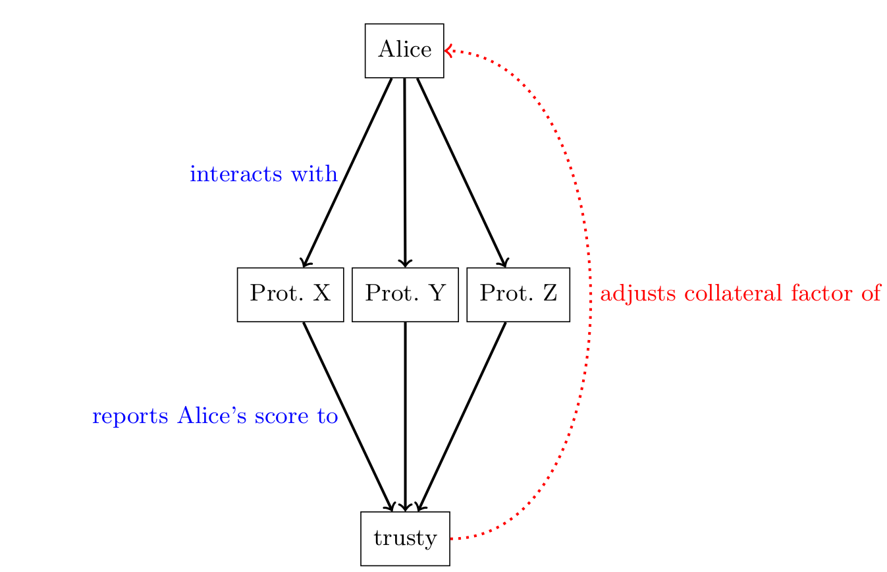
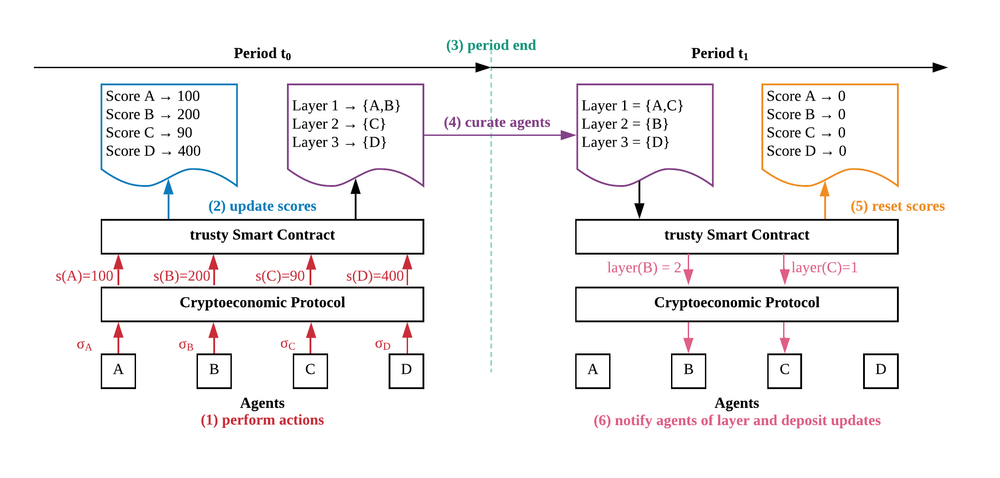

# TL;DR

Collateral is the core security mechanism for DeFi protocols. Dai, Compound, Synthetix and others rely on agents to lock their coins, which in turn back newly created assets.
Locking collateral, however, represents an opportunity cost for agents: they could use these coins to e.g. become a staking node in Ethereum or trade their coins for a profit on exchanges. 
We propose trusty, a system that allows agents to lower their collateral in a wide range of protocols implemented on Ethereum. 
Notably, the decrease of collateral provides the same level of protection against economically rational adversaries as before. 
To achieve this security property, the decrease of collateral has a lower boundary at the expected opportunity cost of having the collateral locked in a given protocol. 
Further, agents need to continuously perform "desired actions" in a protocol to enjoy the lower collateral bounds.

This is a work-in-progress. The purpose of this post is to receive feedback on the idea of trusty.

# Secure Collateral Reduction for Many Protocols

In decentralized ledgers, deposits replace other manifestations of trust. Instead of an explicit ranking (e.g. stars on Amazon or karma on Reddit) or personal relationships, an agent (human or machine) trusts another agent (human or machine) if enough coins are provided as security. These coins represent an assurance that the counterparty has skin in the game. The idea is that if the counterparty misbehaves, a mechanism is able to punish the cheating party and reimburse the agent suffering from those actions.

So everything solved in blockchain paradise? Not quite. Determining how much deposit an agent is required is a tricky question. The more deposit an agent has to provide the more "safety" a protocol has as it increases the potential punishment in case of misbehaviour. However, the more deposit required, the smaller the set of agents that have enough coins to qualify for participation.

Even worse, most protocols need to account for two main sources of uncertainty. (1) The relative value of the deposit in relation to the risk might change over time, i.e. it is event-dependent. For example, in Dai 150% collateral is required to account for sudden price shocks of the underlying Ether to USD price. (2) Private information needs to be accounted for. For example, an agent might have some hidden motivations, external incentives (bribing), or simply can choose between different protocols.

Event-dependency and private information usually require protocols to over-collateralize. Simply put, if the risk is of value `1`, a designer of protocol typically multiplies the risk value with a factor `f` that accounts for both sources of uncertainty. This is the case for most DeFi protocols like Dai or Compound. In other protocols, say TrueBit or PoS staking, the risk is not entirely clear. In these cases, an estimate of the required deposit needs to be made. In any case there is an inherent dilemma between agents providing services (and having to provide the deposit) and agents receiving services.

## Introducing trusty

We propose trusty as a remedy to the problem of over-collateralization. We do not solve the problem of determining how much collateral is required, but rather offer a way to *securely* reduce existing collateral requirements to a lower bound. trusty is intended to be a plug-in to a range of different protocols.

In trusty, Alice interacts with a couple of protocols `X`, `Y`, and `Z` that require a deposit. Those protocols report their interactions with Alice to the trusty smart contract. The trusty smart contract in return tracks how much relative collateral Alice needs to provide in the different protocols. The schematic interactions of trusty are shown in the figure below:

Suitable protocols for our mechanism have the following properties:

- Require deposits to protect against rational adversaries.
- Require over-collateralization (or have no clearly assigned risk value).
- Require eventually finalized decisions whether or not an agent behaved correctly.

The idea builds on the [Balance paper](https://eprint.iacr.org/2019/675.pdf) and uses it as the core mechanism. 
The proposal is a response to Problem 12 in [Hard Problems in Cryptocurrencies](https://github.com/ethereum/wiki/wiki/Problems#12-reputation-systems).

## Reputation in Blockchains

Reputation in decentralized and permissionless systems must be different from other systems that have some notion of inherent trust.
We cannot rely on a trusted third-party to maintain a list of a reputation of different agents in a system.
Further, we cannot rely on strong identities and, on purpose, must tolerate Sybil identities.

Problem 12 in [Hard Problems in Cryptocurrencies](https://github.com/ethereum/wiki/wiki/Problems#12-reputation-systems) lists four distinct sub-problems.
We address these problems with our system.

1. Single-shot attacks in reputation: an agent can act honestly for a  number of rounds and when trusted enough, acts maliciously.
2. Reputation boosting: an agent can boost its reputation by creating Sybil identities through which it interacts with itself to increase its reputation. Other agents might rely on that boosted reputation and might be cheated on.
3. Explicit vs implicit reputation: if reputation is expressed as something that is obtainable, i.e. on an open market, agents might be motivated to sell and buy reputation. For example, Alice and Bob can make an agreement to rate each other positively.
4. Compositional trust: Alice might be under-collateralized when dealing with multiple agents. For example, Alice might have a deposit of 2 ETH and uses this deposit to interact with five agents with a risk of 1 ETH each. The five agents might not be aware of each other. If Alice is able to gain 5 ETH from being malicious, it would be individually rational for her to take the 2 ETH damage and gain the 5 ETH.

## trusty Mechanism

trusty implements the functionality of an Ethereum-wide reputation system. In essence, if an agent Alice behaves well in a protocol `X`, Alice can reduce her relative deposit in `X` and other protocols `Y` and `Z`. 
We achieve this through the following functionalities:

1. Revelation: trusty is able to receive the result of agents' interactions with integrated protocols. This means the smart contracts that integrate with trusty are able to report the results on an action into trusty. For example, if an agent interacts in a desired way with the contract, it would be noted as a desired action. If an agent violates the specification, it is reported as an undesired action. 
2. Score Registry: trusty keeps a registry of the "score" of an agent. When Alice interacts with the protocols `X`, `Y`, and `Z` and the result of her actions are reported back to trusty, they are translated into scores. The score gets added (or subtracted) to the overall score of Alice.
3. Collateral Factor Registry: Each agent is mapped to a collateral factor. Each agent starts with the highest possible factor and is able to lower their score based on their actions. Intuitively, the more "desired actions" an agent performs, the lower the collateral factor becomes. However, it is bound by the opportunity cost of the locked collateral. Otherwise, trusty would lower the security against rational agents.
4. Curation: trusty is split into rounds. An agent collects a score in a round. When the round ends (e.g. after a certain number of blocks or after a point in time), the agents score is considered and one of three consequences will happen. (1) if the agent's score is above the bound of its current collateral factor layer, the agent gets promoted to the next layer reducing its collateral factor. (2) if the agent's score is below the current collateral layer bound the agent is demoted into the previous layer resulting in an increased collateral requirement. (3) if the agent's score is in between the bounds, the agent remains in the same layer. If at any point the agent provably commits an undesired action, e.g. cheats in a protocol or falls below its collateral requirements, the agent is automatically set back to the highest collateral level.

## trusty Step-by-Step

trusty is implemented in six steps.

1. Agents are interacting with a set of protocols. Those protocols return the results of the interactions with the agents, i.e. did the agent behave well? The protocols submit the score of the actions to the trusty smart contract.
2. The trusty smart contract has two mappings. One mapping that keeps track of the score of the agents and a second mapping that tracks the assignment of agents to layers. Each layer represents a collateral factor. The lower the layer, the higher the collateral factor. Upon receipt of the scores from the protocols, the trusty smart contract updates the mapping of agents to scores.
3. After a certain number of blocks or a pre-defined time, a period ends and the curation process starts.
4. The curation process considers the scores of agents and (if necessary) maps agents to new layers. Agents can at most move one layer up at a time. Agents can be reset to the lowest layer when they misbehave.
5. The end of the curation process resets all agent scores. This ensures that the agents need to *continuously perform desired actions.
6. The agents can update their collateral in protocols or just enjoy the lower requirements when interacting with other protocols.

## Benefits of trusty

trusty comes with a set of advantages. The main ones are listed here:

- Increased security across protocols: if an agent misbehaves in *at least one* integrated protocol, it will suffer repercussions in *all* protocols by falling back to the highest collateral level. This shifts the incentives for an agent to misbehave to having to face multiple punishments.
- Lowering of opportunity costs: since a well-behaving agent has to provide less collateral in protocols, the agent faces less opportunity cost since the sum of locked collateral is lowered (or the agent can increase its returns since it can participate with more stake, e.g. increasing its chance to get rewarded in PoS).
- Social welfare increase: including trusty into protocols increases the incentive for agents to behave well. In turn, this increases the welfare of the integrated protocols as agents that make use of the protocol have a higher chance that the protocol will not suffer incentive-based attacks.

## Possible Attacks

As this is a work in progress, we have not yet found a mitigation for all attack strategies. In our earlier work on Balance, we can show that we can integrate trusty into a single protocol. However, it remains an open question if *transitive* reputation between protocols can be implemented safely.

### Sybil identities

An agent could create multiple identities to generate more "desired actions" and thereby lower its relative deposit in all integrated protocols.

**Mitigation**: In Balance, we propose to limit the total deposit a single public key can provide to mitigate Sybil identities. We assume there is a non-zero transaction cost with executing the Sybil attack, so executing the Sybil attack would only be beneficial if the absolute gain in collateral reduction is greater than the cost. By disallowing large amounts of deposit, we increase the relative cost of the attack.

However, this does not translate well into the composition of multiple protocols. Our idea is to rather encourage agents to stick to a single identity within one protocol by proportionally allowing them higher collateral reduction with larger stake. That way, agents should not split their available funds over multiple identities, but rather, remain with a single identity.

### Adversarial protocols

One could add adversarial protocols that report arbitrary results. For example, the protocol could report "desired actions" or "undesired actions" based on the identity of the agent. In fact, an agent could be motivated to deploy such protocols to specifically attack certain agents in other protocols.

If Eve can convince trusty to add her protocol `EVIL` to the list of integrated protocols and Eve can convince Alice to participate, then Eve could report "undesired actions" by Alice that would lead to Alice falling back to the highest collateral level. Similarly, Eve could create such a protocol and allow disproportionally high rewards for desired actions for herself.

**Mitigation**: This is an open research question. One way to solve it would be to have a committee or a governance token with which existing agents can vote which new protocols to include. However, proving that this is secure is not trivial.

### Privacy concerns

Assuming Alice uses the same public key in any protocol, others could trivially learn quite a lot about Alice. Even though transactions in Ethereum are public, it takes at least *some* effort to correlate different identities. If Alice is required to use the same public key across different protocols, trusty would give a clear log of Alice's actions.

**Mitigation**: This is an open question as well. One way could be to let Alice prove that she owns multiple public keys to the trusty smart contract in zero knowledge. trusty could then link multiple public keys together without knowing who they belong to.

## Next Steps

- Formal security proofs: We want to prove that trusty is secure when integrated into several protocols. We are working on extending our formal model from the [Balance paper](https://eprint.iacr.org/2019/675.pdf).
- Practical applicability: We want to find a way to integrate other protocols without having to change their code.
- Proof of concept implementation: We want to extend the [Balance smart contracts](https://github.com/nud3l/balance) for multiple protocols.
- Privacy features: We want to explore how to ensure privacy of agents integrating with trusty.
